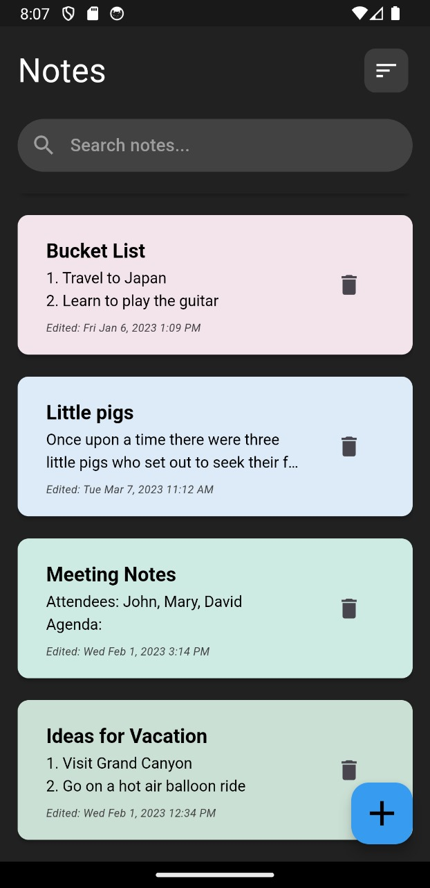
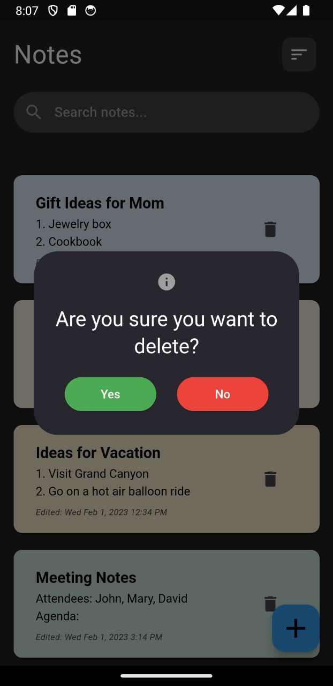

# NOTEZZ
A Flutter application that allows users to Create, Read, Update and Delete notes.


##  TABLE OF CONTENTS

- [Installation](#installation)
- [Screenshots](#screenshots)
- [Credits](#credits)

## INSTALLATION

```bash
git clone https://github.com/Harshit-Bhakta/flutter_NOTEZZ
cd flutter_NOTEZZ
flutter pub get
```

## SCREENSHOTS


| Home Page | Notes Page | Delete Promt |
| --- | --- | --- |
|    |  |  |


## CREDITS

- [FLUTTER](https://flutter.dev/)
- [DART](https://dart.dev/)
- [VS CODE](https://code.visualstudio.com/)
